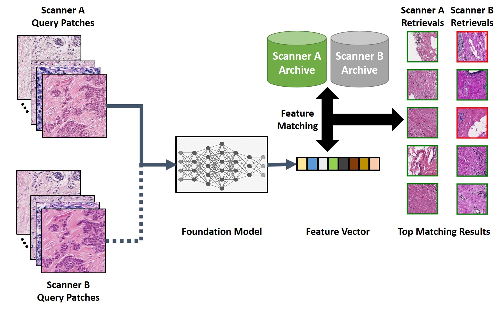
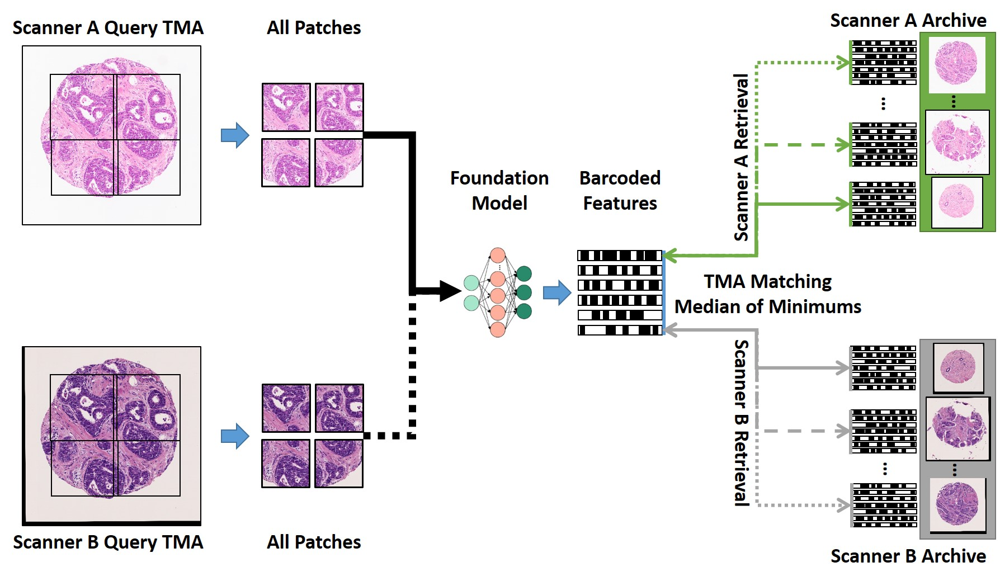

<p align="center"><a href="https://www.torontomu.ca/akhademi/">
  
</a></p>


<!-- omit in toc -->
# [Reliability of Foundation Models for Image Retrieval in Histopathology]()
<!-- omit in toc -->

## Cross-Scanner Image Retrieval Reliability Evaluation Framework

a) Patch-Level Retrieval
<p align="center">
 
</p>
b) TMA-Level Retrieval
<p align="center">
 
</p>

Ensuring fairness and explainability is essential for the development of ethical, reliable, and effective AI systems in healthcare. Bias in AI models can contribute to disparities in clinical outcomes, challenging equity in medical decision-making. Content-Based Image Retrieval (CBIR) offers interpretable, visual tools to support diagnostic processes; however, these tools remain susceptible to biases inherent in the data. This study examines fairness and explainability in AI systems for healthcare, focusing on bias in CBIR for histopathology. Specifically, it investigates how differences between scanning devices can introduce covariate bias into Foundation Models (FMs). To enable this analysis, the authors created a unique dataset of spatially aligned histopathology images scanned by two different devices, allowing them to directly study the impact of scanner variability on FM representations.

## Patch-Level Retrieval
**Given that all the Embeddings of Spatially corresponding ID and OOD patches are already extracted and stored with corresponding ID and OOD indices:**
<br>
```Patch_Level_Search``` Notebook [Patch_Level_Search.ipynb](https://github.com/IAMLAB-Ryerson/Reliability_Search-Retrieval/blob/main/Patch_Level_Search.ipynb) takes in already generated embeddings, labels and image paths from the corresponding registered patches for ID and OOD **Query** and **Archive** in order to evaluate the cross-scanner retrieval reliability.
<br>
**Expected patch-level input format:**
```
ID Query:                                                   | OOD Query: 
── ID-All_Query_Embeds / Labels / file_paths                | ── OOD-All_Query_Embeds / Labels / file_paths
    ├── ID Query Patch / Label / patch_path 1               |    ├── OOD Query Patch / Label / patch_path 1
    ├── ID Query Patch / Label / patch_path 2               |    ├── OOD Query Patch / Label / patch_path 2
    ├── ID Query Patch / Label / patch_path 3               |    ├── OOD Query Patch / Label / patch_path 3
    .                                                       |    .
    .                                                       |    .
    .                                                       |    .
                                                            |
ID Archive:                                                 | OOD Archive: 
── ID-All_Archive_Embeds / Labels / file_paths              | ── OOD-All_Archive_Embeds / Labels / file_paths
    ├── ID Archive Patch / Label / patch_path 1             |    ├── OOD Archive Patch / Label / patch_path 1
    ├── ID Archive Patch / Label / patch_path 2             |    ├── OOD Archive Patch / Label / patch_path 2
    ├── ID Archive Patch / Label / patch_path 3             |    ├── OOD Archive Patch / Label / patch_path 3
    .                                                       |    .
    .                                                       |    .
    .                                                       |    .
```
<br>
First, ID Query patches are matched againt the ID Archive patches to find similar patches using Euclidean, cosine, and Hammind distances.
Second, for the cross-scanner retrieval, OOD Query Patches are matched against the ID Archive to find the most similar patches using Euclidean, cosine, and Hammind distances.

<br>
All the results are saved in the "current working directory".

## Slide-Level Retrieval
**Given that all the Embeddings of Spatially corresponding ID and OOD patches are already extracted and stored with corresponding ID and OOD indices:**
<br>
```TMA_Level_Search``` Notebook [TMA_Level_Search.ipynb](https://github.com/IAMLAB-Ryerson/Reliability_Search-Retrieval/blob/main/TMA_Level_Search.ipynb) takes in already generated TMA embeddings, labels and image paths from the corresponding registered slides from two scanners in order to evaluate the cross-scanner retrieval reliability.
<br>
**Expected slide-level input format:**
```
ID Query:                                                   | OOD Query: 
── ID-All_Query_Embeds / Labels / file_paths                | ── OOD-All_Query_Embeds / Labels / file_paths
    ├── ID Query Slide / Label / slide_path 1               |    ├── OOD Query Slide / Label / slide_path 1
    |   |── patch 1 Embeds                                  |    |   |── patch 1 Embeds
    |   |── patch 2 Embeds                                  |    |   |── patch 2 Embeds
    |   |── patch 3 Embeds                                  |    |   |── patch 3 Embeds
    |   ...                                                 |    |   ...  
    ├── ID Query Slide / Label / slide_path 2               |    ├── OOD Query Slide / Label / slide_path 2 
    |   |── patch 1 Embeds                                  |    |   |── patch 1 Embeds 
    |   |── patch 2 Embeds                                  |    |   |── patch 2 Embeds 
    |   |── patch 3 Embeds                                  |    |   |── patch 3 Embeds 
    |   ...                                                 |    |   ...     
    ├── ID Query Slide / Label / slide_path 3               |    ├── OOD Query Slide / Label / slide_path 3
    |   |── patch 1 Embeds                                  |    |   |── patch 1 Embeds  
    |   |── patch 2 Embeds                                  |    |   |── patch 2 Embeds  
    |   |── patch 3 Embeds                                  |    |   |── patch 3 Embeds  
    |   ....                                                |    |   ....     
    .                                                       |    .
    .                                                       |    .
    .                                                       |    .
ID Archive:                                                 | OOD Archive: 
── ID-All_Archive_Embeds / Labels / file_paths              | ── OOD-All_Archive_Embeds / Labels / file_paths
    ├── ID Archive Slide / Label / slide_path 1             |    ├── OOD Archive Slide / Label / slide_path 1
    |   |── patch 1 Embeds                                  |    |   |── patch 1 Embeds  
    |   |── patch 2 Embeds                                  |    |   |── patch 2 Embeds  
    |   |── patch 3 Embeds                                  |    |   |── patch 3 Embeds  
    |   ....                                                |    |   ....    
    ├── ID Archive Slide / Label / slide_path 2             |    ├── OOD Archive Slide / Label / slide_path 2
    |   |── patch 1 Embeds                                  |    |   |── patch 1 Embeds  
    |   |── patch 2 Embeds                                  |    |   |── patch 2 Embeds  
    |   |── patch 3 Embeds                                  |    |   |── patch 3 Embeds  
    |   ....                                                |    |   ....    
    ├── ID Archive Slide / Label / slide_path 3             |    ├── OOD Archive Slide / Label / slide_path 3
    |   |── patch 1 Embeds                                  |    |   |── patch 1 Embeds  
    |   |── patch 2 Embeds                                  |    |   |── patch 2 Embeds  
    |   |── patch 3 Embeds                                  |    |   |── patch 3 Embeds  
    |   ....                                                |    |   ....    
    .                                                       |    .
    .                                                       |    .
    .                                                       |    .
```
<br>
For TMA/Slide level evaluation, leave-one-patient-out evaluation is used to go over all the data. For TMA, we used all the available patches to perform search and retrieval.
<br>
```Optional:``` For Whole Slide, Yottixel mosaic [Generate_Mosaic.ipynb](https://github.com/IAMLAB-Ryerson/Reliability_Search-Retrieval/blob/main/Generate_Mosaic.ipynb) can be used to get coordinates for the selected patches, and the coordinates are used to get embeddings from the registered slides from both scanners using [Generate_Mosaic_Embeds.ipynb](https://github.com/IAMLAB-Ryerson/Reliability_Search-Retrieval/blob/main/Generate_Mosaic_Embeds.ipynb).
<br>
All the results are saved in the "current working directory".
## Citation
```
@article{shafique2026reliability,
  title={Reliability of Foundation Models for Image Retrieval in Histopathology},
  author={Shafique, Abubakr and Qin, Xiaoli and Dy, Amanda and Alshamlan, Najd and Androutsos, Dimitrios and Done, Susan J and Khademi, April},
  journal={npj Imaging},
  volume={},
  number={},
  pages={},
  year={2026},
  publisher={Nature Publishing Group UK London}
}
```

## Disclaimer
This code is intended for research purposes only. Any commercial use is prohibited.


